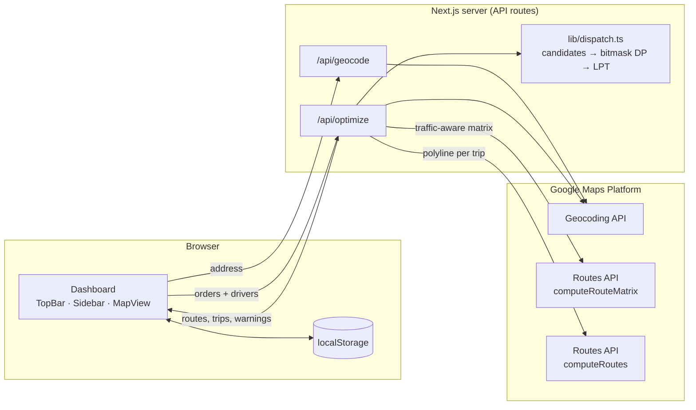

# 🍕 Peppes Route Optimizer

[](https://github.com/uSadiki/PeppesRouting/actions/workflows/ci.yml)


A real-time **delivery dispatch and route optimizer** built for a pizza
restaurant. Staff type addresses into a terminal as orders come in. The app
decides **which orders to batch together, in what order to deliver them, and
which driver takes which trip**. It optimizes for driver time and for pizzas
that are **still hot when they arrive**.

It uses live, traffic-aware travel times from the Google Routes API. Each tour
gets its own colour on a dark-themed map, with its road-following route drawn in.

---

## Table of contents

- [Why this project is interesting](#why-this-project-is-interesting)
- [Features](#features)
- [How the optimizer works](#how-the-optimizer-works)
- [Architecture](#architecture)
- [Testing](#testing)
- [Getting started](#getting-started)
- [API reference](#api-reference)
- [Project structure](#project-structure)
- [Design decisions & trade-offs](#design-decisions--trade-offs)
- [Limitations & future work](#limitations--future-work)

---

## Why this project is interesting

A pizza place doesn't fit the textbook Travelling Salesman Problem:

- **Pizzas get cold.** A route that is short for the driver can still be bad
  if the last customer's pizza sat in the bag for 25 minutes.
- **Drivers do several round trips.** Each one leaves the store, drops off one
  to three bags, and comes back. It's a *multi-trip vehicle routing problem*.
- **Promises are soft.** An ASAP order has a 40-minute delivery promise, and
  a scheduled order should arrive close to its time slot. Breaking a promise
  is costly, but every order still has to be delivered.
- **It runs live.** The plan is recomputed in the middle of a busy shift, so
  it has to finish in milliseconds.

The optimizer models all four. It finds the **provably optimal** way to group
orders into trips, and the test suite checks that claim against an exhaustive
brute-force solver (see [Testing](#testing)).

## Features

| | |
|---|---|
| ⌨️ **Keyboard-first entry** | The address field auto-focuses and re-focuses after every Enter, so staff can enter a stack of tickets without touching the mouse. |
| 📍 **Instant geocoding** | Each address is geocoded as it's added, and its pin shows up before you optimize. Failed lookups are flagged inline. |
| ⏱️ **ASAP & scheduled orders** | ASAP orders carry a delivery promise (40 / 50 / 60 min for normal, busy and very busy shifts). Scheduled orders aim for their time slot, give or take 15 minutes. |
| 🚗 **Multi-driver, multi-trip dispatch** | Choose 1–99 drivers. Orders are batched into trips of up to 3 and balanced across drivers. |
| 🌡️ **Freshness-aware** | The optimizer never plans a multi-stop trip where a pizza would spend more than 20 minutes in the bag. |
| 🚦 **Live traffic** | Travel times come from Google's `computeRouteMatrix` with `TRAFFIC_AWARE` routing. |
| 🗺️ **Colour-coded map** | Every tour gets its own colour, road-following polyline, and numbered stops (`2.1` = tour 2, stop 1) that match the sidebar. |
| 🕐 **"Suggested drive-out" time** | For tours with scheduled orders, the app works back from the tightest promise to the latest time the driver can leave. |
| 💾 **Survives refreshes** | The queue, driver count and delivery promise are saved to `localStorage`, so a reload or a power blip doesn't lose active orders. |
| 🛟 **Graceful degradation** | If the Routes API is disabled or unavailable, the app falls back to straight-line (haversine) estimates and shows a warning with a link to enable the API. It doesn't crash. |

## How the optimizer works

The algorithm is in [`lib/dispatch.ts`](lib/dispatch.ts). It runs in three
stages.

### 1. Build a travel-time matrix

The depot and every order go into one Routes API `computeRouteMatrix` call,
which returns an (n+1)×(n+1) matrix of traffic-aware durations and distances.
Cells the API can't route (for example, ferry-only pairs) fall back to a
haversine estimate.

### 2. Enumerate and score every candidate trip

A *trip* is `depot → 1…K stops → depot`, with `K ≤ 3` (one thermal bag). For
every subset of orders up to size K, the optimizer finds the best visit order
and scores it:

```
cost(trip) = trip duration                                   (driver time)
           + W_fresh  · Σ in-bag seconds per pizza            (freshness)
           + W_sched  · Σ |arrival − promised time|           (scheduled orders)
           + W_window · Σ seconds outside the delivery window (late or too early)
```

- For **≤ 4 stops** it tries every permutation, so the visit order is exact.
- For **> 4 stops** it uses nearest-neighbour construction plus **2-opt**
  local search.
- A multi-stop trip is **thrown out** if any pizza would exceed
  `MAX_IN_BAG_SECONDS` (20 min). Single-stop trips are always kept, so every
  order can always be delivered.
- Time windows are **soft**. A late order adds to the cost but is never
  dropped.

### 3. Pick the best set of trips, then balance drivers

Choosing which trips to run is a **set-partitioning problem**: cover every
order exactly once at the lowest total cost. The optimizer solves it exactly
with **dynamic programming over bitmasks**:

```
dp[∅] = 0
dp[S] = min over candidate trips T ⊆ S of  dp[S \ T] + cost(T)
```

The chosen trips are then assigned to drivers with the **LPT
(Longest-Processing-Time-first)** rule, a classic 4/3-approximation for
minimising the last driver's finish time: sort trips longest-first and give
each one to the least-loaded driver.

When there are at least as many drivers as orders, a shortcut applies: each
order gets its own driver and goes straight out.

### Tunable parameters

The parameters are defined at the top of
[`app/api/optimize/route.ts`](app/api/optimize/route.ts):

| Constant | Default | Meaning |
|---|---|---|
| `SERVICE_TIME_SECONDS` | 120 | Time spent at each door |
| `FRESHNESS_WEIGHT` | 1.0 | 1 min of pizza-in-bag costs the same as 1 min of driver time |
| `MAX_TRIP_SIZE` | 3 | Orders per thermal bag |
| `MAX_IN_BAG_SECONDS` | 1200 | Hard cap on the coldest pizza in a multi-stop trip |
| `SCHEDULE_WINDOW_MINUTES` | 15 | ± window around a scheduled delivery time |
| `SCHEDULE_PREFERENCE_WEIGHT` | 0.03 | Pull toward the exact promised time |
| `TIME_WINDOW_PENALTY_WEIGHT` | 1.0 | Cost per second outside the delivery window |

### Performance

The DP is exponential in the number of open orders (2ⁿ states), but the
hot-bag limit removes most candidate trips before the DP runs. Measured on
random instances (3 drivers, Node 22):

| Open orders | 8 | 12 | 16 | 18 |
|---|---|---|---|---|
| Solve time | 3 ms | 12 ms | 39 ms | 202 ms |

That's well within budget for a single store's live queue.

## Architecture



- **Server-side key.** The Google calls that cost money (Geocoding and
  Routes) run in Next.js API routes. The server key goes in an
  `X-Goog-Api-Key` header, never in the browser.
- **Pure, testable core.** `lib/dispatch.ts`, `lib/optimizer.ts` and
  `lib/tour-plan.ts` are plain functions with no I/O, so they're easy to test
  deterministically.
- **Typed end to end.** Request and response shapes live in
  [`lib/types.ts`](lib/types.ts) and are shared by the client and the API
  routes.

## Testing

```bash
npm test               # run the suite once
npm run test:watch     # watch mode
npm run test:coverage  # with a V8 coverage report (HTML in ./coverage)
```

**80 tests · ~97% line coverage** of `lib/` and the API routes, using
[Vitest](https://vitest.dev). CI runs the type-check, the tests with coverage,
and a production build on every push.

| Suite | What it proves |
|---|---|
| [`dispatch.test.ts`](tests/dispatch.test.ts) | **Checks optimality against a brute-force oracle**: on 60 random instances, the DP's total cost equals the best of *all* set partitions. Property tests over 150 random instances check that every order is delivered exactly once, bag and size limits hold, and in-bag times are consistent. Scenario tests cover batching neighbours, splitting opposite directions, deadlines that re-order a trip, scheduled orders aiming for their slot, and LPT giving two drivers identical finish times. |
| [`optimizer.test.ts`](tests/optimizer.test.ts) | Haversine against known distances (1° at the equator, Oslo → Bergen). k-means stays deterministic and never leaves a cluster empty. The TSP heuristic is **never worse than nearest-neighbour** and is **optimal on ≥ 85%** of 300 random instances (observed: 90%, worst case 1.17× optimal). |
| [`api.test.ts`](tests/api.test.ts) | Runs the real Next.js route handlers end to end against a **fake Google backend** (mocked `fetch`). Covers a full plan, server-side geocoding of orders that lack coordinates, clamping of the delivery promise, **graceful fallback when the Routes API is disabled**, 4xx/5xx error mapping, and that the API key is sent in a header. |
| [`tour-plan.test.ts`](tests/tour-plan.test.ts) | Sidebar grouping, dropping stale orders, detecting unassigned orders, and working out the drive-out time from the tightest scheduled promise. |
| [`storage.test.ts`](tests/storage.test.ts) | Persistence round-trips, recovering from corrupted storage, migrating legacy fields, input sanitising, quota errors, and SSR safety (runs in jsdom). |
| [`colors.test.ts`](tests/colors.test.ts) | The palette is distinct, adjacent tours get different colours, and colours wrap around. |

A few testing techniques used here:

- **Seeded PRNG (mulberry32).** The "random" property tests are fully
  reproducible, so any failure can be replayed exactly.
- **Hand-checkable fixtures.** `lineMatrix()` puts stops on a 1-D road, so
  expected durations like `600 + 120 + 60 + 120 + 660` can be worked out on
  paper.
- **Mutation-checked.** Planting a bug in the DP (take the first feasible
  partition instead of the cheapest) makes 4 tests fail, including the
  brute-force oracle.

## Getting started

### Prerequisites

- Node.js **22+**
- A Google Cloud project with these APIs enabled:
  - Maps JavaScript API
  - Geocoding API
  - Routes API (`computeRouteMatrix`, `computeRoutes`)

### Setup

```bash
git clone https://github.com/uSadiki/PeppesRouting.git
cd PeppesRouting
npm install
cp .env.example .env.local   # then fill in your keys
npm run dev
```

Open <http://localhost:3000>.

### Environment variables

| Variable | Where it's used | Description |
|---|---|---|
| `GOOGLE_MAPS_API_KEY` | Server | Geocoding and Routes API calls. Keep it unrestricted by referrer, but restrict it by API. |
| `NEXT_PUBLIC_GOOGLE_MAPS_API_KEY` | Browser | Renders the map. **Restrict by HTTP referrer** in production, because it's visible to clients. |
| `NEXT_PUBLIC_BASE_LOCATION` | Both | Depot address every trip starts and ends at (default `Hellinga 3`). |
| `NEXT_PUBLIC_REGION` | Both | ISO 3166-1 region bias for geocoding (default `NO`). |

### Scripts

| Command | Description |
|---|---|
| `npm run dev` | Start the dev server |
| `npm run build` / `npm start` | Production build / serve |
| `npm run typecheck` | Run `tsc --noEmit` in strict mode |
| `npm test` | Run the test suite |
| `npm run test:coverage` | Run the tests with a coverage report |

## API reference

### `POST /api/geocode`

```jsonc
// request
{ "address": "Karl Johans gate 1", "region": "NO" }

// 200 OK
{ "ok": true, "lat": 59.911, "lng": 10.749, "formattedAddress": "Karl Johans gate 1, 0154 Oslo, Norway" }

// 200 with no match | 400 bad input | 502 upstream unreachable
{ "ok": false, "error": "No match for that address." }
```

### `POST /api/optimize`

```jsonc
// request
{
  "drivers": 2,
  "maxDeliveryMinutes": 40,          // clamped to 15–120, default 40
  "optimizeAtEpochMs": 1768496400000, // optional, defaults to server time
  "orders": [
    { "id": "a1", "address": "Storgata 1", "type": "ASAP", "lat": 59.91, "lng": 10.75, "createdAt": 1768496000000 },
    { "id": "b2", "address": "Frognerveien 7", "type": "Scheduled", "scheduledFor": "2026-01-15T19:00" }
  ]
}
```

Orders without `lat`/`lng` are geocoded on the server. The response contains
one `DriverRoute` per driver. Each route holds a list of `Trip`s, and each trip
has its colour, encoded polyline, the stop sequence with cumulative
"in-bag" seconds, and totals. The response also echoes the parameters that
were used and any non-fatal `warnings`. The full shape is `OptimizeResponse`
in [`lib/types.ts`](lib/types.ts).

| Status | When |
|---|---|
| `200` | A plan was produced (it may include fallback `warnings`) |
| `400` | Malformed JSON or an empty order list |
| `500` | Missing server key, or an address could not be geocoded |
| `502` | A Google API returned an unexpected error |

## Project structure

```
app/
  api/
    geocode/route.ts     POST /api/geocode:  address → coordinates
    optimize/route.ts    POST /api/optimize: Google I/O + dispatch → routes
  layout.tsx
  page.tsx               Dashboard state, persistence, and API orchestration
components/
  TopBar.tsx             Branding, fast order entry, driver count
  OrderInput.tsx         Auto-focusing input with ASAP/Scheduled toggle
  Sidebar.tsx            Optimize button, delivery-promise selector, warnings
  OrdersList.tsx         Queue grouped by tour, with suggested drive-out times
  MapView.tsx            Dark-styled Google Map, polylines, numbered pins
lib/
  dispatch.ts            ★ Trip scoring, bitmask set-partition DP, LPT balancing
  optimizer.ts           Haversine, k-means clustering, NN + 2-opt TSP
  tour-plan.ts           Derives sidebar groupings and drive-out hints
  storage.ts             Defensive localStorage persistence
  colors.ts              High-contrast tour palette
  types.ts               Shared request/response types
tests/                   Vitest suites and shared fixtures
.github/workflows/ci.yml Type-check, test and build on every push
```

## Design decisions & trade-offs

- **Exact DP instead of a metaheuristic.** For the queue sizes a single store
  sees, an exact answer is cheap, and it is deterministic, so the same input
  always gives the same plan. That matters when a dispatcher re-runs the
  optimizer mid-shift and expects stable routes.
- **Freshness as a cost *and* a limit.** The weighted in-bag term favours hot
  deliveries in general. The 20-minute cap makes sure no single customer gets
  a cold pizza just to save the driver a few minutes.
- **Soft time windows.** Hard windows can make a problem infeasible, which in
  practice means an order gets silently dropped. Penalties mean every order
  is always routed, and lateness shows up in the plan.
- **Routes API v2 over the legacy Distance Matrix.** It has traffic-aware
  ETAs, per-cell route conditions, and structured error details, which the
  app uses to link directly to the "enable this API" page.
- **Outbound-only polylines.** Only depot → last stop is drawn, which keeps
  the map readable. The return leg is still counted in trip duration.

## Limitations & future work

- The DP runs in O(2ⁿ · candidates). Past about 20 open orders, a
  column-generation or ALNS approach would scale better.
- Every trip is planned as if it leaves *now*. It doesn't yet model a driver
  starting their second trip after returning, or pizzas that aren't out of
  the oven yet.
- `clusterPoints` (k-means) in `lib/optimizer.ts` is from an earlier
  cluster-first, route-second design. It's kept as a tested utility for
  comparing against the DP.
- Possible next steps: kitchen-ready times, driver shift constraints,
  real-time driver GPS, and a history view for comparing planned and actual
  delivery times.
